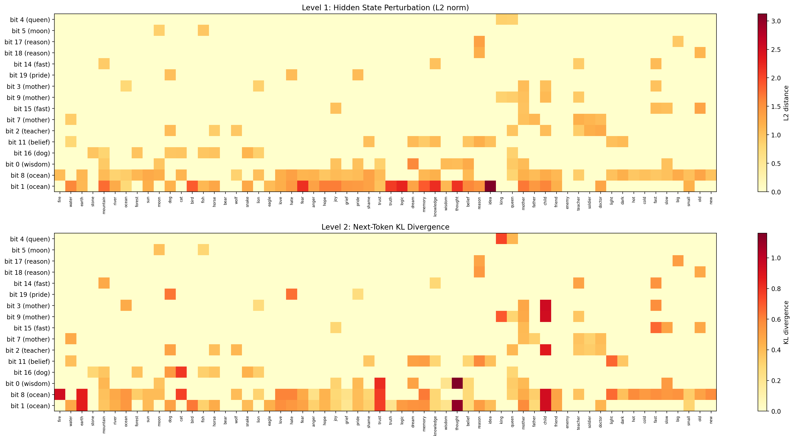

# reptimeline

[](https://github.com/arturoornelasb/reptimeline/actions/workflows/ci.yml)
[](https://www.python.org/downloads/)
[](LICENSE)

**Track how discrete representations evolve during neural network training.**

reptimeline monitors lifecycle events in discrete representation systems: when concepts are "born" (first become distinguishable), when they "die" (collapse), when relationships form, and where phase transitions occur. It then discovers what each feature means, labels it, and tests causal effects.

Backend-agnostic: works with triadic bits, VQ-VAE codebooks, FSQ levels, sparse autoencoders, binary codes, or any discrete bottleneck.

## Features

- **Lifecycle tracking** -- birth, death, and connection events for individual code elements across training
- **Phase transition detection** -- automatic discovery of training regime changes via metric discontinuities
- **Bottom-up ontology discovery** -- duals, dependencies, 3-way interactions, and hierarchical structure without pre-defined primitives
- **Auto-labeling** -- three strategies: embedding-based, contrastive, and LLM-based
- **Causal verification** -- intervention testing with bootstrap CIs, permutation p-values, and BH-FDR correction
- **Theory reconciliation** -- compare discovered structure against manually-defined domain primitives
- **Visualizations** -- swimlane diagrams, phase dashboards, churn heatmaps, layer emergence, and causal heatmaps

## Tech Stack

| Component | Details |
|-----------|---------|
| Language | Python 3.10 -- 3.13 |
| Core dependencies | numpy >= 1.24, matplotlib >= 3.7 |
| Optional | torch >= 2.0 (for model extractors) |
| Testing | pytest, pytest-cov, 212 tests |
| Linting | ruff (zero warnings), mypy (zero errors) |
| CI | GitHub Actions (tests + lint + typecheck + coverage) |
| Docs | pdoc3, auto-deployed to GitHub Pages |
| License | BUSL-1.1 (converts to AGPL-3.0 on 2030-03-21) |

## Installation

From source (recommended -- PyPI publication pending):
```bash
git clone https://github.com/arturoornelasb/reptimeline.git
cd reptimeline
pip install -e ".[dev]"
```

To run the examples (MNIST, Pythia SAE, causal experiments):
```bash
pip install -r requirements-examples.txt
```

## Quick Start

### 1. Use a built-in extractor or implement your own

Three backends ship ready to use:

```python
from reptimeline.extractors import SAEExtractor, VQVAEExtractor, FSQExtractor

# Sparse Autoencoder (top-k binarization, intervention support)
sae = SAEExtractor(n_features=32768, encode_fn=my_sae.encode,
                   decode_fn=my_sae.decode, feature_indices=selected)

# VQ-VAE (codebook index → binary indicator)
vqvae = VQVAEExtractor(n_codebook=512, encode_fn=my_vqvae.encode)

# FSQ (finite scalar quantization, nonzero or one-hot binarization)
fsq = FSQExtractor(n_levels=[3, 5, 3, 3], encode_fn=my_fsq.encode)
```

Or implement `RepresentationExtractor` for any other discrete bottleneck:

```python
from reptimeline.extractors.base import RepresentationExtractor
from reptimeline.core import ConceptSnapshot

class MyExtractor(RepresentationExtractor):
    def extract(self, checkpoint_path, concepts, device='cpu'):
        codes = {}
        for concept in concepts:
            codes[concept] = get_discrete_code(model, concept)  # List[int]
        return ConceptSnapshot(step=parse_step(checkpoint_path), codes=codes)

    def similarity(self, code_a, code_b):
        ...  # Jaccard, Hamming, or domain-specific

    def shared_features(self, code_a, code_b):
        ...  # Indices where both codes are active
```

See `examples/` for complete pipelines (MNIST binary AE, Pythia-70M SAE, triadic bits).

### 2. Analyze representation evolution

```python
from reptimeline import TimelineTracker

extractor = MyExtractor()
snapshots = extractor.extract_sequence("checkpoints/", concepts)
tracker = TimelineTracker(extractor)
timeline = tracker.analyze(snapshots)
timeline.print_summary()
```

### 3. Discover what each code element means

```python
from reptimeline import BitDiscovery, AutoLabeler

discovery = BitDiscovery()
report = discovery.discover(snapshots[-1], timeline=timeline)
discovery.print_report(report)

# Auto-label with embeddings (no API needed)
labeler = AutoLabeler()
labels = labeler.label_by_embedding(report, embeddings)
```

### 4. Test causal effects

```python
from reptimeline import CausalVerifier

verifier = CausalVerifier(labels)
causal_report = verifier.verify(intervene_fn, concepts)
```

### 5. CLI

```bash
reptimeline --snapshots data.json --discover --plot
reptimeline --snapshots data.json --overlay primitivos.json --output result.json
reptimeline --snapshots data.json --causal effects.json --plot-dir plots/
```

## Architecture

```
Your model checkpoints
        |
        v
RepresentationExtractor    (SAE, VQ-VAE, FSQ built-in, or your own)
        |  ConceptSnapshot objects
        v
TimelineTracker            (births, deaths, connections, phase transitions)
        |
        v
BitDiscovery               (duals, dependencies, 3-way interactions, hierarchy)
        |
        v
AutoLabeler                (embedding / contrastive / LLM labeling)
        |
        v
CausalVerifier             (intervention effects + statistical testing)
        |
        v
Reconciler                 (compare discovered vs. expected structure)
        |
        v
Visualizations             (swimlane, phase dashboard, churn, causal heatmap)
```

## Validated Results

### MNIST Binary Autoencoder (32-bit)

| Metric | Value |
|--------|-------|
| Decoder determinism | 100% (32-bit code fully determines output; n=100 swaps) |
| Dual pairs discovered | 9 anti-correlated |
| Phase transitions | 3 detected automatically |
| Lifecycle tracking | 6 epochs, 10 digit classes |

### Pythia-70M Sparse Autoencoder (32K features)

| Metric | Value |
|--------|-------|
| Causal selectivity (KL) | 8 features with finite selectivity (1.96x--98.4x, mean 26.8x L2); 8 with zero cross-activation |
| Dual pairs discovered | 34 anti-correlated |
| Lifecycle tracking | 12 checkpoints (step 1 to 143K) |

<p align="center">

<br>
<em>Causal intervention on Pythia-70M SAE features. Yellow = no effect; dark red = strong effect.</em>
</p>

## Limitations

- **Prediction experiments did not improve over baseline.** Using discovered SAE features for next-token prediction produced -0.13% (embedding-based) and -4.20% (MLP-based) accuracy relative to baseline. Features are individually meaningful but do not yet translate to prediction improvements.
- **Sentinel features.** 8 of 16 tested SAE features showed zero cross-activation, which may reflect SAE sparsity rather than proven causal selectivity. These are reported separately.
- **Statistical corrections.** Discovery includes Bonferroni and BH-FDR correction. Use `null_baseline()` to estimate false positive rates for your data dimensions.

## Project Structure

```
reptimeline/
  __init__.py             # Public API
  __main__.py             # python -m reptimeline
  core.py                 # ConceptSnapshot, Timeline, lifecycle events
  tracker.py              # TimelineTracker
  discovery.py            # BitDiscovery: bottom-up ontology
  autolabel.py            # AutoLabeler: 3 labeling strategies
  reconcile.py            # Reconciler: discovered vs. theory
  causal.py               # CausalVerifier: intervention testing
  stats.py                # Bootstrap, permutation tests, BH-FDR
  cli.py                  # Command-line interface
  extractors/
    base.py               # RepresentationExtractor ABC
    sae.py                # Sparse autoencoder extractor
    vqvae.py              # VQ-VAE extractor
    fsq.py                # FSQ extractor
  overlays/
    primitive_overlay.py  # Domain-specific primitive overlay
  viz/
    swimlane.py           # Concept activation swimlane
    phase_dashboard.py    # Metric trends + phase transitions
    churn_heatmap.py      # Per-concept code churn
    layer_emergence.py    # Layer stabilization order
    causal_heatmap.py     # Causal intervention effects
tests/                    # 16 test modules, 212 tests (pytest)
examples/                 # Reference pipelines and extractors
results/                  # Pre-computed results (MNIST, Pythia-70M)
```

## Tests

```bash
# Run tests with coverage
pytest tests/ -v --cov=reptimeline

# Lint
ruff check reptimeline/ tests/
```

CI runs both on every push and PR (Python 3.10 -- 3.13).

## License

[Business Source License 1.1](LICENSE) (BUSL-1.1)

- **Free** for research, education, evaluation, development, and personal use
- **Commercial production use** requires a license -- contact arturoornelas62@gmail.com
- Converts to [AGPL-3.0](https://www.gnu.org/licenses/agpl-3.0.html) on 2030-03-21

## Citation

```bibtex
@software{ornelas2026reptimeline,
  author = {Ornelas Brand, José Arturo},
  title = {reptimeline: Tracking Discrete Representation Evolution During Training},
  year = {2026},
  url = {https://github.com/arturoornelasb/reptimeline}
}
```

## Origin

Extracted from [triadic-microgpt](https://github.com/arturoornelasb/triadic-microgpt).
Paper: "Prime Factorization as a Neurosymbolic Bridge" (Ornelas Brand, J.A., 2026).
